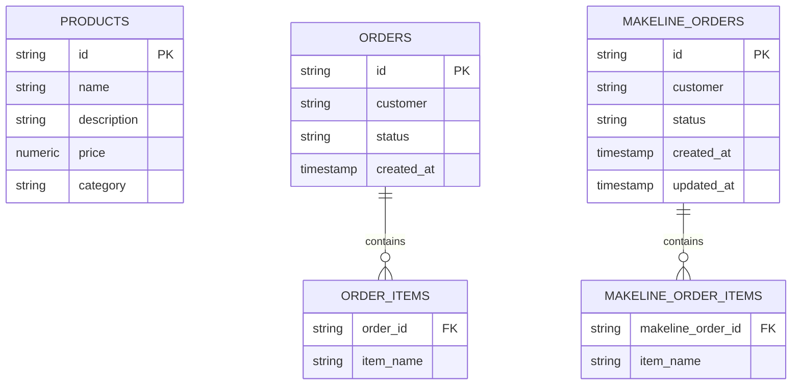

# Pet Store Microservices

A modern, **100% pure Java 21 & Spring Boot 4.1.1** multi-module microservices application modeled after the functional architecture of the [Azure AKS Store Demo](https://github.com/Azure-Samples/aks-store-demo).

> [!NOTE]
> **Pure Spring Boot Stack**: Unlike the original polyglot reference project (which used Node.js, Go, Python, and Vue.js), this entire repository is standardized on **Java 21 LTS and Spring Boot 4.1.1**. All web dashboards, back-office portals, background traffic simulators, and microservices are built natively using Spring Boot with zero external runtime dependencies on Node/npm, Python, or Go.

---

## Architecture Overview

```mermaid
flowchart TD
    subgraph Clients & Traffic Simulators (Pure Spring Boot)
        SF["Store Front UI (:8080)<br/>Spring Boot Web"]
        SA["Store Admin UI (:8084)<br/>Spring Boot Web"]
        VC["Virtual Customer Simulator (:8085)<br/>Spring Boot Scheduled Runner"]
        VW["Virtual Worker Simulator (:8086)<br/>Spring Boot Scheduled Runner"]
    end

    subgraph Core Business Services (Pure Spring Boot)
        PS["Product Service (:8081)<br/>Spring Data JPA + PostgreSQL"]
        OS["Order Service (:8082)<br/>Spring Data JPA + AMQP"]
        MS["Makeline Service (:8083)<br/>Spring Data JPA + AMQP"]
    end

    subgraph Persistence & Messaging
        PG[("PostgreSQL 16 (:5432)")]
        RMQ{{"RabbitMQ 3.13 (:5672/:15672)"}}
    end

    SF -->|Browse Catalog| PS
    SF -->|Submit Orders| OS
    VC -->|Periodic Orders| OS
    VC -->|Fetch Catalog| PS

    SA -->|Catalog Manager| PS
    SA -->|Order History| OS
    SA -->|Kitchen Queue| MS
    VW -->|Complete Orders| MS

    OS -->|Persist Order| PG
    OS -->|Publish 'order.created'| RMQ
    RMQ -->|Consume 'order.created'| MS
    MS -->|Persist Makeline Order| PG
    PS -->|Persist Products| PG
```

---

## Services & Ports Reference

| Service | Port | Tech Stack | Role & Functionality |
|---|:---:|:---:|---|
| **`store-front`** | `8080` | **Spring Boot 4.1.1 Web** (Embedded UI & API Gateway) | Customer shopping web interface and reverse proxy for products & checkout |
| **`store-admin`** | `8084` | **Spring Boot 4.1.1 Web** (Responsive Admin Portal) | Back-office operations portal: Live kitchen makeline, catalog CRUD, order history |
| **`product-service`** | `8081` | **Spring Boot 4.1.1, Spring Data JPA** | Product catalog management with PostgreSQL relational storage and seed data |
| **`order-service`** | `8082` | **Spring Boot 4.1.1, Spring Data JPA, AMQP** | Order intake API, PostgreSQL storage, and `order.created` RabbitMQ event producer |
| **`makeline-service`** | `8083` | **Spring Boot 4.1.1, Spring Data JPA, AMQP** | Order fulfillment processing, RabbitMQ listener, and order lifecycle management |
| **`virtual-customer`** | `8085` | **Spring Boot 4.1.1 Scheduled Runner** | Background load generator simulating randomized customer purchases |
| **`virtual-worker`** | `8086` | **Spring Boot 4.1.1 Scheduled Runner** | Background fulfillment simulator completing pending makeline kitchen orders |
| **`postgres`** | `5432` | PostgreSQL 16 (Alpine) | Central database storing catalog items, order records, and makeline queue |
| **`rabbitmq`** | `5672` / `15672` | RabbitMQ 3.13 Management | Event broker with web dashboard (`guest`/`guest`) |

---

## Azure Reference vs. Pure Spring Boot Parity Matrix

| Feature | Original Azure AKS Demo (Polyglot) | This Repository (**100% Pure Spring Boot**) |
|---|:---:|:---:|
| **Language & Runtime** | Polyglot (Go, Node.js, Python, Rust) | **Java 21 LTS & Spring Boot 4.1.1** across all 7 services |
| **Store Front UI** | Vue.js + Node.js | **Spring Boot Web (`store-front`)** (Port 8080) |
| **Store Admin UI** | Vue.js + Node.js | **Spring Boot Web (`store-admin`)** (Port 8084) |
| **Product Catalog** | Go / In-Memory & AI Search | **Spring Boot + Spring Data JPA (`product-service`)** (Port 8081) |
| **Order Processing** | Node.js / Express | **Spring Boot REST + JPA (`order-service`)** (Port 8082) |
| **Makeline Fulfillment** | Go / In-Memory | **Spring AMQP Listener + JPA Entity Queue (`makeline-service`)** (Port 8083) |
| **Traffic Simulators** | Python (`virtual-customer`, `virtual-worker`) | **Spring Boot Scheduled Runners** (Ports 8085, 8086) |
| **Messaging Bus** | RabbitMQ | **RabbitMQ with Exchange & Dead-Letter Queue** |
| **Database** | MongoDB / Cosmos DB | **PostgreSQL 16 Relational Tables** |

---

## Database Relational Model

The PostgreSQL instance (`petstore` database) automatically creates and manages relational tables:



---

## Prerequisites

- **Podman 5.x+** (or Docker Desktop) with machine running:
  ```powershell
  podman machine start
  ```
- **Podman Compose** or Docker Compose CLI.
- **Java 21 & Maven 3.9+** (optional, for local IDE development).

---

## Quickstart: Running with Podman / Docker Compose

### 1. Launch All Services

```powershell
# Using podman compose
podman compose up --build -d

# Or using docker compose (with Podman backend)
docker-compose up -d
```

### 2. Verify Container Health

```powershell
podman ps
```

Expected output showing 9 active containers:
- `pet-store-postgres-1` (`healthy`)
- `pet-store-rabbitmq-1` (`healthy`)
- `pet-store-product-service-1`
- `pet-store-order-service-1`
- `pet-store-makeline-service-1`
- `pet-store-store-front-1`
- `pet-store-store-admin-1`
- `pet-store-virtual-customer-1`
- `pet-store-virtual-worker-1`

### 3. Open Applications in Browser

- **Customer Store Front**: [http://localhost:8080](http://localhost:8080)
- **Store Admin Dashboard**: [http://localhost:8084](http://localhost:8084)
- **RabbitMQ Management**: [http://localhost:15672](http://localhost:15672) (User: `guest`, Password: `guest`)

---

## Interactive Walkthrough & Testing

### 1. Watch Background Traffic Simulation

The **Virtual Customer** (`:8085`) and **Virtual Worker** (`:8086`) run automated cycles:

```powershell
docker-compose logs -f virtual-customer virtual-worker
```

### 2. Place Orders Manually via Store Front API

```powershell
# PowerShell
Invoke-RestMethod -Uri "http://localhost:8080/api/orders" -Method Post -ContentType "application/json" -Body '{"customer":"Alice","items":["dog-bed","cat-tower"]}'
```

```bash
# cURL
curl -X POST http://localhost:8080/api/orders \
  -H "Content-Type: application/json" \
  -d '{"customer":"Alice","items":["dog-bed","cat-tower"]}'
```

### 3. Query Makeline Kitchen Queue

```powershell
# View pending (IN_PROGRESS) kitchen orders
Invoke-RestMethod -Uri "http://localhost:8083/api/makeline/orders?status=IN_PROGRESS" | ConvertTo-Json -Depth 5

# View all orders (including COMPLETED)
Invoke-RestMethod -Uri "http://localhost:8083/api/makeline/orders" | ConvertTo-Json -Depth 5
```

### 4. Complete an Order via Store Admin API

```powershell
Invoke-RestMethod -Uri "http://localhost:8084/api/admin/makeline/orders/<ORDER_ID>/complete" -Method Post
```

### 5. Manage Products via Store Admin Catalog API

```powershell
# Add a new product
Invoke-RestMethod -Uri "http://localhost:8084/api/admin/products" -Method Post -ContentType "application/json" -Body '{"id":"laser-pointer","name":"Laser Pointer Toy","description":"Hours of entertainment for pets","price":14.99,"category":"toys"}'

# Verify product appears in catalog
Invoke-RestMethod -Uri "http://localhost:8081/api/products"
```

---

## Configuration & Environment Variables

| Variable | Default Value | Description |
|---|---|---|
| `SPRING_DATASOURCE_URL` | `jdbc:postgresql://postgres:5432/petstore` | JDBC connection string |
| `SPRING_DATASOURCE_USERNAME` | `petstore` | PostgreSQL username |
| `SPRING_DATASOURCE_PASSWORD` | `petstore` | PostgreSQL password |
| `SPRING_RABBITMQ_HOST` | `rabbitmq` | AMQP host |
| `SPRING_RABBITMQ_PORT` | `5672` | AMQP port |
| `PRODUCT_SERVICE_URL` | `http://product-service:8081` | Product service base URL for proxies & simulators |
| `ORDER_SERVICE_URL` | `http://order-service:8082` | Order service base URL for front & simulators |
| `MAKELINE_SERVICE_URL` | `http://makeline-service:8083` | Makeline service base URL for admin & worker |
| `SIMULATION_ORDER_INTERVAL_MS` | `8000` | Frequency for `virtual-customer` order generation (ms) |
| `SIMULATION_WORKER_INTERVAL_MS` | `10000` | Frequency for `virtual-worker` fulfillment polling (ms) |

---

## Manual Multi-Stage Container Builds

To build individual multi-stage Docker/Podman images from repository root:

```powershell
podman build -t pet-store-product-service:latest -f services/product-service/Dockerfile .
podman build -t pet-store-order-service:latest -f services/order-service/Dockerfile .
podman build -t pet-store-makeline-service:latest -f services/makeline-service/Dockerfile .
podman build -t pet-store-store-front:latest -f services/store-front/Dockerfile .
podman build -t pet-store-store-admin:latest -f services/store-admin/Dockerfile .
podman build -t pet-store-virtual-customer:latest -f services/virtual-customer/Dockerfile .
podman build -t pet-store-virtual-worker:latest -f services/virtual-worker/Dockerfile .
```

---

## Stopping & Teardown

```powershell
# Stop and remove all containers and data volumes
docker-compose down -v
# Or
podman compose down -v
```

---

## Code Quality & Formatting

Formatting and enforcement rules are centralized in the Maven reactor:

```powershell
mvn spotless:apply   # Formats Java sources using Google Java Format
mvn spotless:check   # Validates formatting during CI/CD
```
