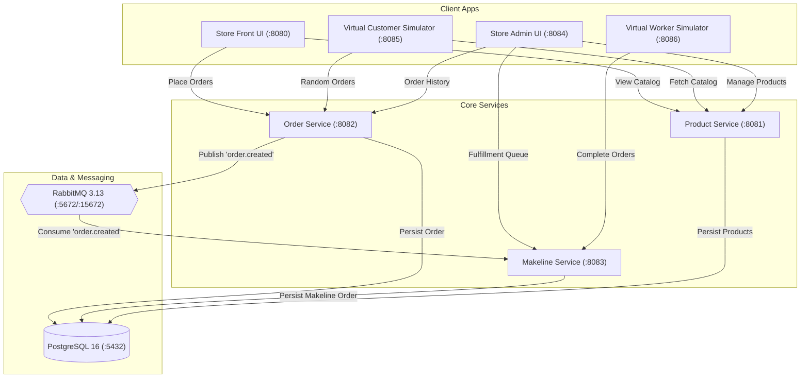

# Pet Store Microservices

A modern Java 21 & Spring Boot 3 multi-module microservices application modeled after the [Azure AKS Store Demo](https://github.com/Azure-Samples/aks-store-demo). It features customer-facing and back-office web dashboards, PostgreSQL persistence with Spring Data JPA, asynchronous event-driven order processing via RabbitMQ, automated background traffic simulators, multi-stage container builds, and Kubernetes manifests.

---

## System Architecture



---

## Services & Ports Reference

| Service | Port | Technology | Description |
|---|:---:|:---:|---|
| **`store-front`** | `8080` | Spring Boot 3 / HTML5 / JS | Customer shopping web UI & reverse proxy gateway |
| **`store-admin`** | `8084` | Spring Boot 3 / HTML5 / JS | Back-office management portal for catalog & kitchen makeline queue |
| **`product-service`** | `8081` | Spring Boot 3 / Spring Data JPA | Product catalog with PostgreSQL relational persistence and CRUD APIs |
| **`order-service`** | `8082` | Spring Boot 3 / JPA / RabbitMQ | Order creation, PostgreSQL persistence, and AMQP event publishing |
| **`makeline-service`** | `8083` | Spring Boot 3 / JPA / RabbitMQ | Asynchronous AMQP consumer, order fulfillment queue, and status management |
| **`virtual-customer`** | `8085` | Spring Boot 3 / Scheduled Runner | Background traffic generator creating realistic customer orders periodically |
| **`virtual-worker`** | `8086` | Spring Boot 3 / Scheduled Runner | Background kitchen worker processing and completing makeline orders |
| **`postgres`** | `5432` | PostgreSQL 16 (Alpine) | Central relational persistence store (`petstore` database) |
| **`rabbitmq`** | `5672` / `15672` | RabbitMQ 3.13 Management | Message broker with web management console |

---

## Prerequisites

- **Podman 5.x+** with machine initialized and running:
  ```powershell
  podman machine start
  ```
- **Podman Compose** or Docker Compose CLI configured with the Podman / Docker socket.
- **Java 21 & Maven 3.9+** (optional, for local IDE development).

---

## Running Locally with Podman / Docker Compose

### 1. Start the entire ecosystem

Run Docker/Podman compose from the repository root:

```powershell
# Using podman compose
podman compose up --build -d

# Or using docker compose (with Podman backend)
docker-compose up -d
```

### 2. Verify all containers

```powershell
podman ps
```

All 9 containers will be up and running:
- `pet-store-postgres-1`
- `pet-store-rabbitmq-1`
- `pet-store-product-service-1`
- `pet-store-order-service-1`
- `pet-store-makeline-service-1`
- `pet-store-store-front-1`
- `pet-store-store-admin-1`
- `pet-store-virtual-customer-1`
- `pet-store-virtual-worker-1`

### 3. Open Web Dashboards

- **Store Front**: [http://localhost:8080](http://localhost:8080) — Customer catalog and cart checkout.
- **Store Admin**: [http://localhost:8084](http://localhost:8084) — Real-time kitchen makeline, catalog editor, and order logs.
- **RabbitMQ Console**: [http://localhost:15672](http://localhost:15672) (User: `guest`, Password: `guest`).

---

## End-to-End Testing & Verification

### Observe Background Simulators

The **Virtual Customer** creates orders automatically every few seconds, and the **Virtual Worker** picks up `IN_PROGRESS` kitchen orders and completes them:

```powershell
docker-compose logs -f virtual-customer virtual-worker
```

### Manual Order Placement

**Place a new customer order:**

```powershell
# PowerShell
Invoke-RestMethod -Uri "http://localhost:8080/api/orders" -Method Post -ContentType "application/json" -Body '{"customer":"Alice","items":["dog-bed","cat-tower"]}'
```

```bash
# cURL
curl -X POST http://localhost:8080/api/orders \
  -H "Content-Type: application/json" \
  -d '{"customer":"Alice","items":["dog-bed","cat-tower"]}'
```

### Check Makeline Queue

```powershell
# Fetch all kitchen orders (IN_PROGRESS and COMPLETED)
Invoke-RestMethod -Uri "http://localhost:8083/api/makeline/orders" | ConvertTo-Json -Depth 5
```

### Complete an Order Manually via Admin API

```powershell
# Mark order completed
Invoke-RestMethod -Uri "http://localhost:8084/api/admin/makeline/orders/<ORDER_ID>/complete" -Method Post
```

### Product Catalog CRUD

```powershell
# List products
Invoke-RestMethod -Uri "http://localhost:8081/api/products"

# Add a new product
Invoke-RestMethod -Uri "http://localhost:8081/api/products" -Method Post -ContentType "application/json" -Body '{"id":"laser-pointer","name":"Laser Pointer","description":"Hours of fun for cats","price":9.99,"category":"toys"}'
```

---

## Building Images Manually with Podman

Each service uses an optimized multi-stage `Dockerfile` leveraging Java 21:

```powershell
podman build -t pet-store-product-service:latest -f services/product-service/Dockerfile .
podman build -t pet-store-order-service:latest -f services/order-service/Dockerfile .
podman build -t pet-store-makeline-service:latest -f services/makeline-service/Dockerfile .
podman build -t pet-store-store-front:latest -f services/store-front/Dockerfile .
podman build -t pet-store-store-admin:latest -f services/store-admin/Dockerfile .
podman build -t pet-store-virtual-customer:latest -f services/virtual-customer/Dockerfile .
podman build -t pet-store-virtual-worker:latest -f services/virtual-worker/Dockerfile .
```

---

## Stopping the Services

```powershell
docker-compose down -v
# or
podman compose down -v
```

---

## Code Quality & Formatting

Formatting and enforcement rules are centralized in the Maven reactor:

```powershell
mvn spotless:apply   # Formats Java files using Google Java Format
mvn spotless:check   # Validates formatting
```
